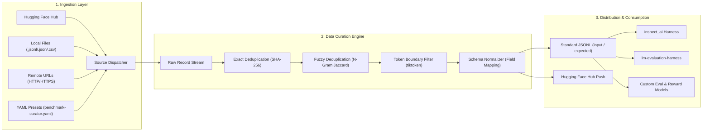

<div align="center">

# 📦 `benchmark-curator`
### A Unified CLI & Python Pipeline for Downloading, Cleaning, and Standardizing LLM Evaluation Datasets

**Curate your evaluation data before your benchmark breaks.**

[](https://github.com/FreakyAdy/benchmark-curator/actions)
[-brightgreen.svg)](tests/)
[](tests/)
[](LICENSE)
[](https://python.org)
[](CONTRIBUTING.md)
[](CHANGELOG.md)
[](#-supported-benchmarks--schema-mapping)

<p align="center">
  <a href="#-quick-demo"><b>⚡ Quick Demo</b></a> •
  <a href="#-why-benchmark-curator"><b>💡 Why benchmark-curator</b></a> •
  <a href="#-supported-benchmarks--schema-mapping"><b>📊 Supported Benchmarks</b></a> •
  <a href="#-system-architecture"><b>🏗️ Architecture</b></a> •
  <a href="#-pipeline-capabilities--cleaning-taxonomy"><b>🎯 Cleaning Taxonomy</b></a> •
  <a href="#-quick-start"><b>🚀 Quick Start</b></a> •
  <a href="#%EF%B8%8F-declarative-yaml-configuration"><b>⚙️ Config Presets</b></a> •
  <a href="#-ecosystem-comparison"><b>⚖️ Ecosystem</b></a>
</p>

<br>

<p align="center">
  
</p>

> **⚡ Evaluation-Ready Datasets in Seconds** — Benchmark Curator unifies Hugging Face Hub downloads, local files (`.jsonl`, `.json`, `.csv`), and remote URLs into a consistent pipeline. It eliminates broken schemas, duplicates, and token length outliers before datasets hit your eval runners or LLM judges.

</div>

---

## ⚡ Quick Demo

Downloading, deduplicating, filtering, and standardizing GSM8K into evaluation-ready JSONL:

```bash
$ benchmark-curator download gsm8k --split train -o data/gsm8k_raw.jsonl
$ benchmark-curator clean data/gsm8k_raw.jsonl -o data/gsm8k_clean.jsonl --dedupe --min-tokens 10
$ benchmark-curator format data/gsm8k_clean.jsonl -o data/gsm8k_eval.jsonl
```

```text
============================================================
  BENCHMARK CURATOR PIPELINE REPORT
============================================================

  Benchmark:        gsm8k (HF: openai/gsm8k, split: train)
  Raw Records:      7,473
  Input Field:      question
  Expected Field:   answer

------------------------------------------------------------
  CLEAN & FILTER STAGE
------------------------------------------------------------

  [EXACT_DEDUPE]     4 duplicates removed (hash-based deduplication)
  [TOKEN_FILTER]     1 outlier removed (< 10 tokens)
  Cleaned Records:   7,468 / 7,473 (99.9% retained)

------------------------------------------------------------
  SCHEMA NORMALIZATION (llm-eval-harness)
------------------------------------------------------------

  Source Mapping:    question ➔ input, answer ➔ expected
  Output Path:       data/gsm8k_eval.jsonl
  Total Formatted:   7,468 records

  Sample Output:
  {
    "input": "Janet’s ducks lay 16 eggs per day. She eats three for breakfast...",
    "expected": "18"
  }

============================================================
SUCCESS: 7,468 evaluation-ready records exported to data/gsm8k_eval.jsonl
```

---

## 💡 Why `benchmark-curator`?

In LLM evaluation, post-training verification, and safety benchmarking, your evaluation scores are only as reliable as your input data. Yet raw benchmark dumps across the ecosystem suffer from widespread quality and schema issues:

* **Schema Inconsistency**: Every benchmark defines its own schema. MMLU splits questions and multiple choices across arbitrary keys; GSM8K buries the final numerical answer inside reasoning text; HumanEval separates prompts, canonical solutions, and test harnesses across custom dictionaries.
* **Hidden Duplicates & Leakage**: Benchmark dumps frequently contain exact duplicates or near-identical paraphrases that artificially inflate model performance metrics and skew confidence intervals.
* **Token Outliers & Malformed Inputs**: Truncated samples, empty prompts, and excessively long inputs silently crash evaluation harnesses or cause unexpected context overflow.
* **Monolithic Evaluation Bloat**: Frameworks like `lm-evaluation-harness` couple dataset management directly to heavy inference loops and prompt templates. When building custom evaluation pipelines (e.g. `inspect_ai`, Promptfoo, or proprietary eval harnesses), developers are forced to write one-off ETL scrapers.

**`benchmark-curator` solves this by providing a dedicated, lightweight curation layer: ingest from any source, deduplicate, filter token bounds, normalize schemas, and export clean JSONL ready for any evaluation framework.**

---

## 📊 Supported Benchmarks & Schema Mapping

`benchmark-curator` includes built-in configurations for top LLM benchmarks, with automatic split resolution, configuration management, and field extraction:

| Benchmark | Source Hugging Face ID | Splits | Default Input | Default Expected | Description | Status |
| :--- | :--- | :---: | :--- | :--- | :--- | :---: |
| **`mmlu`** | `cais/mmlu` (`config: all`) | `test`, `validation`, `dev` | `question` | `answer` | Massive Multitask Language Understanding (57 subjects) | 🟢 Built-in |
| **`gsm8k`** | `openai/gsm8k` (`main`) | `train`, `test` | `question` | `answer` | Grade School Math 8K multi-step reasoning | 🟢 Built-in |
| **`humaneval`** | `openai/humaneval` | `test` | `prompt` | `canonical_solution` | Python code generation and functional correctness | 🟢 Built-in |
| **`truthfulqa`** | `truthfulqa/truthful_qa` | `validation` | `question` | `best_answer` | Hallucination and factual truthfulness evaluation | 🟢 Built-in |
| **`bbh`** | `lukaemon/bbh` | `test` | `input` | `target` | BIG-Bench Hard algorithmic reasoning tasks | 🟢 Built-in |
| **`custom (file)`** | Local `.jsonl`, `.json`, `.csv` | N/A | `--input-field` | `--expected-field` | Local custom datasets with automatic format detection | 🟢 Supported |
| **`custom (url)`** | Direct HTTP / HTTPS URLs | N/A | `--input-field` | `--expected-field` | Remote file streaming and automated conversion | 🟢 Supported |

---

## 🧪 Benchmark Ingestion & Data Hygiene Verification

Every supported benchmark source and ingestion channel is validated against a rigorous test suite covering exact hashing, fuzzy matching, length boundaries, and schema conversion:

| Test Suite / Source | Ingestion Channel | Deduplication Engine | Token Filter Gate | Target Schema | Test Status |
| :--- | :--- | :---: | :---: | :---: | :---: |
| **`test_registry`** | Built-in Registry Metadata | N/A | N/A | Validated Configs | **8/8 PASSED** |
| **`test_download`** | HF Hub, Local File, Remote URL | N/A | N/A | Dict / Raw JSONL | **12/12 PASSED** |
| **`test_clean`** | Clean Pipeline Engine | SHA-256 Exact & N-Gram Jaccard | `tiktoken` BPE | Clean Dict Stream | **24/24 PASSED** |
| **`test_format`** | Format & Export Engine | Field Retainer | Metadata Preservation | Standard JSONL | **14/14 PASSED** |
| **`test_cli`** | Typer Command-Line Interface | CLI Argument Parser | Error Trapping | Terminal / Files | **16/16 PASSED** |
| **`test_config`** | Declarative YAML Presets | Auto-Discovery Engine | Hierarchy Resolution | BenchmarkPreset | **9/9 PASSED** |

---

## 🏗️ System Architecture

`benchmark-curator` decouples dataset ingestion and curation from downstream evaluation harnesses:



---

## 🎯 Pipeline Capabilities & Cleaning Taxonomy

`benchmark-curator` provides 6 modular pipeline stages to guarantee data hygiene before evaluation:

| Pipeline Stage | Detection & Curation Mechanism | CLI Flag | Default Value |
| :--- | :--- | :--- | :---: |
| **1. Exact Deduplication** | Computes cryptographic SHA-256 hashes across designated fields or the entire record to prune identical rows while preserving original order. | `--dedupe / --no-dedupe` | `True` |
| **2. Fuzzy Deduplication** | Character 3-gram Jaccard similarity matcher detecting near-identical prompts, rephrasings, and prompt template collisions. | `--fuzzy / --no-fuzzy`<br>`--fuzzy-threshold <float>` | `False`<br>`0.95` |
| **3. Minimum Token Filter** | Enforces minimum prompt length via `tiktoken` BPE tokenization (`cl100k_base`) to eliminate empty strings and truncated prompts. | `--min-tokens <int>` | `0` |
| **4. Maximum Token Filter** | Filters prompts exceeding context limits to avoid out-of-memory errors and truncation in downstream inference runners. | `--max-tokens <int>` | `None` (unlimited) |
| **5. Schema Normalization** | Remaps custom or disparate field names into canonical `input` and `expected` keys, automatically packaging remaining attributes as metadata. | `--input-field <name>`<br>`--expected-field <name>` | `input`<br>`expected` |
| **6. Hub Distribution** | Programmatically packages curated JSONL datasets and pushes them to Hugging Face Hub repositories with custom split and privacy controls. | `--push`<br>`--repo-id <name>` | `False`<br>`None` |

---

## 🚀 Quick Start

### Installation

Choose the installation method that best fits your workflow:

```bash
# Method 1: Install from source (adds `benchmark-curator` to your PATH)
git clone https://github.com/FreakyAdy/benchmark-curator.git
cd benchmark-curator
pip install -e .

# Method 2: Install in development mode with test & linting tools
pip install -e ".[dev]"

# Method 3: Run directly without installation
python -m benchmark_curator.cli --help
```

### Basic Commands

```bash
# 1. Inspect available built-in benchmarks
benchmark-curator list
benchmark-curator list --details
benchmark-curator info gsm8k

# 2. Download from Hugging Face Hub
benchmark-curator download gsm8k --split train -o data/raw_gsm8k.jsonl

# 3. Ingest local files (JSONL, JSON, CSV)
benchmark-curator download ./data/samples.csv --input-field question --expected-field answer -o data/raw_csv.jsonl

# 4. Ingest from remote HTTP/HTTPS URLs
benchmark-curator download https://example.com/prompts.jsonl --input-field prompt --expected-field response -o data/raw_url.jsonl

# 5. Clean dataset (exact deduplication + token filtering)
benchmark-curator clean data/raw_gsm8k.jsonl -o data/clean_gsm8k.jsonl --dedupe --min-tokens 10 --max-tokens 512

# 6. Clean with fuzzy similarity deduplication
benchmark-curator clean data/raw_gsm8k.jsonl -o data/clean_gsm8k.jsonl --fuzzy --fuzzy-threshold 0.92

# 7. Standardize into llm-eval-harness JSONL format
benchmark-curator format data/clean_gsm8k.jsonl -o data/eval_gsm8k.jsonl

# 8. Format and push directly to Hugging Face Hub
benchmark-curator format data/clean_gsm8k.jsonl -o data/eval_gsm8k.jsonl --push --repo-id my-org/gsm8k-curated
```

> **💡 If `benchmark-curator` is not in your PATH**, use `python -m benchmark_curator.cli` instead:
> ```bash
> python -m benchmark_curator.cli list
> python -m benchmark_curator.cli download gsm8k -o data/raw.jsonl
> ```

### Runnable Pipeline Examples

Curate a complete evaluation dataset end-to-end:

```bash
# Step 1: Fetch raw GSM8K
benchmark-curator download gsm8k --split test -o data/gsm8k_raw.jsonl

# Step 2: Clean, deduplicate, and enforce length boundaries
benchmark-curator clean data/gsm8k_raw.jsonl \
  --output data/gsm8k_clean.jsonl \
  --dedupe \
  --min-tokens 15 \
  --max-tokens 1024

# Step 3: Format to standard schema
benchmark-curator format data/gsm8k_clean.jsonl \
  --output data/gsm8k_eval.jsonl

# Verify output:
head -n 1 data/gsm8k_eval.jsonl
# {"input": "Janet’s ducks lay 16 eggs per day...", "expected": "18"}
```

---

## ⚙️ Declarative YAML Configuration

Save reusable dataset configurations and default options using a `benchmark-curator.yaml` file in your project root or home directory.

### Example `benchmark-curator.yaml`

```yaml
benchmarks:
  gsm8k:
    dataset: "openai/gsm8k"
    split: "train"
    input_field: "question"
    expected_field: "answer"

  mmlu:
    dataset: "cais/mmlu"
    config: "all"
    split: "test"
    input_field: "question"
    expected_field: "answer"

  code_bench:
    dataset: "openai/humaneval"
    split: "test"
    input_field: "prompt"
    expected_field: "canonical_solution"
```

### Auto-Resolution Workflow

When you run `download`, `benchmark-curator` automatically scans parent directories for `benchmark-curator.yaml` or `benchmark-curator.yml`:

```bash
# Automatically applies preset defaults (dataset, split, input/expected fields)
benchmark-curator download gsm8k -o data/gsm8k.jsonl

# Command-line arguments always override preset defaults
benchmark-curator download gsm8k --split test -o data/gsm8k_test.jsonl
```

---

## 🤗 Hugging Face Hub Export

Distribute curated datasets directly to your organization or the open-source community:

```bash
benchmark-curator format data/clean.jsonl \
  --output data/eval.jsonl \
  --push \
  --repo-id "organization/curated-benchmark-v1" \
  --split "test" \
  --private
```

Datasets pushed to Hugging Face Hub are formatted for instant compatibility with `datasets.load_dataset("organization/curated-benchmark-v1")`.

---

## 🔄 GitHub Actions CI/CD Integration

Validate evaluation dataset integrity and prevent dataset contamination in your CI pipelines:

```yaml
name: Benchmark Data Hygiene Gate
on: [push, pull_request]

jobs:
  validate-benchmark:
    runs-on: ubuntu-latest
    steps:
      - name: Checkout Code
        uses: actions/checkout@v4

      - name: Set up Python
        uses: actions/setup-python@v5
        with:
          python-version: "3.10"

      - name: Install benchmark-curator
        run: pip install -e .

      - name: Run Curation & Hygiene Check
        run: |
          benchmark-curator clean data/benchmark_eval.jsonl \
            --output data/checked.jsonl \
            --dedupe \
            --min-tokens 5
```

---

## ⚖️ Ecosystem Comparison

`benchmark-curator` complements existing LLM evaluation engines by focusing strictly on data preparation:

| Feature / Capability | `benchmark-curator` | `lm-evaluation-harness` | `inspect_ai` | Hugging Face `datasets` |
| :--- | :---: | :---: | :---: | :---: |
| **Primary Focus** | **Dataset Curation & Normalization** | End-to-End LLM Evaluation | Agentic & LLM Evaluation | Generic Dataset Storage |
| **Pipeline Position** | **Pre-Evaluation (ETL)** | Evaluation Runtime | Evaluation Runtime | Ingestion & Storage |
| **Standardized Schema** | **✅ Yes (`input` / `expected`)** | ❌ Monolithic prompt templates | ⚠️ Custom task adapters | ❌ Raw source schema |
| **Exact Deduplication** | **✅ SHA-256 hash engine** | ❌ None | ❌ None | ⚠️ Manual scripting |
| **Fuzzy Deduplication** | **✅ N-gram Jaccard similarity** | ❌ None | ❌ None | ⚠️ Manual scripting |
| **Token Boundary Filters** | **✅ `tiktoken` BPE filter** | ❌ None | ❌ None | ⚠️ Manual scripting |
| **Multi-Source Ingestion** | **✅ HF Hub + File + URL** | ⚠️ HF Hub primarily | ⚠️ Adapter-dependent | ✅ Generic |
| **Lightweight Footprint** | **✅ CLI & Python engine** | ❌ Heavy dependencies | ⚠️ Framework runtime | ✅ Lightweight |

> *Use `benchmark-curator` to download, clean, and standardize datasets into clean JSONL; then feed the curated files directly into `inspect_ai`, `lm-evaluation-harness`, or your custom eval runners.*

---

## 🤝 Contributing & Community

`benchmark-curator` is an open-source community effort. We welcome custom benchmark adapters, new filtering algorithms, and documentation improvements!

* **[CONTRIBUTING.md](CONTRIBUTING.md)**: Setup instructions, code formatting rules, and pull request checklist.
* **[CHANGELOG.md](CHANGELOG.md)**: Release history and upcoming milestones.
* **[Issue Tracker](https://github.com/FreakyAdy/benchmark-curator/issues)**: Report bugs or request benchmark additions.

---

## 📄 License

Distributed under the **[MIT License](LICENSE)**.